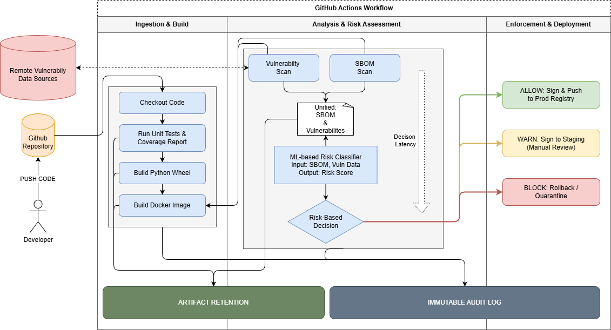
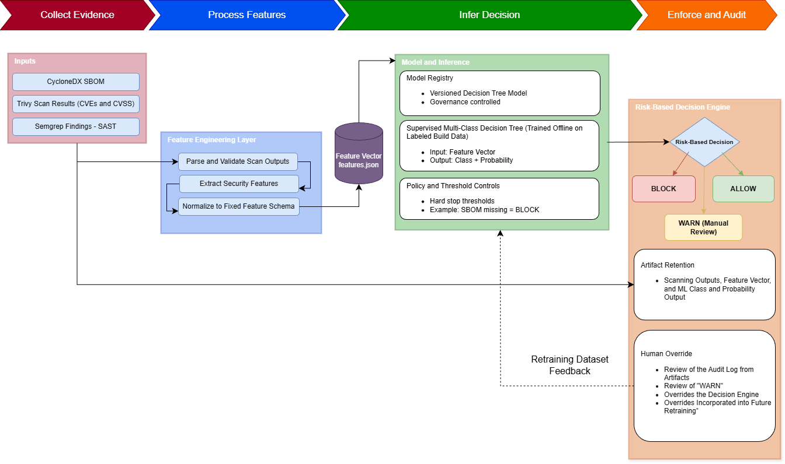

# Risk-Aware Compliance-as-Code: An ML-Gated Secure CI/CD Pipeline for Software Supply Chain Integrity

## Documentation

- [System Architecture](./documentation/architecture/) - High-level system architecture and component design
- [Design](./documentation/design/) - Includes diagrams or documentation detailing the architecture of the pipeline
- [Meetings](./documentation/meetings/) -  Meeting notes as made by the team
- [Project Plan](./documentation/project-plan/) - Project plan document, covering what the project aims to cover and how it plans to do so
- [SRS Document](./documentation/srs/) - Official documentation for the project including scope, design, and requirements

## Software Prototype

[Software Bill of Materials (SBOM)](./research/sbom/README.md)
- Research into SBOM generation, management, and standards (NTIA) for Python and Docker environments
- Includes the following research:
  - Requirements for SBOM in a secure supply chain
  - SBOM generation techniques
  - Industry standard output formats
  - Tools that will fulfill the needs for the project
  - Options within the Github Actions platform

[SAST](./research/SAST/SAST_Overview.md)
- This is to give overview of the role of Static Application Security Testing (SAST) in improving software security within modern CI/CD pipelines and software supply-chain environments. 
- It provides an overview of how SAST tools detect vulnerabilities early in the development lifecycle and how they are integrated with complementary technologies such as Software Bills of Materials (SBOM) generation, dependency vulnerability scanning, and compliance reporting.

[Dynamic Scanning](./research/dynamic_scanning/Dynamic_Scanning.md)
- This is to give an overview on different dynamic scanning tools or techniques to improve the software security within our pipeline

[ML Model](./research/ML_model/)
- Includes documents relating to the risk-aware classification process based upon SBOM, vulnerability scanning, and SAST results
- Key Documents:
  - [nist-ssdf-research](./research/ML_model/nist-ssdf-research.md)
  - [Classification Proposal](./research/ML_model/classification-proposal.md)
  - [Feature Extraction](./research/ML_model/feature-extraction.md)
  - [Training Data Generation Plan](./research/ML_model/training-data-generation-plan.md)

## ML Classifier

The `ml-classifier/` directory contains the active implementation of the pipeline's risk classification stage.

- Scans container images with Trivy to produce CycloneDX JSON SBOMs
- Extracts a 9-feature vector from each SBOM: vulnerability counts, CVSS scores, CWE coverage, and base image age
- Classifies each image as ALLOW, WARN, or BLOCK using a rule-based threshold classifier
- Maintains three pre-scanned training buckets corresponding to the three classification labels
- Decision Tree model training is planned but not yet implemented

## Software Prototype

TODO

## High Level Design

> Details the high-level design for the CI/CD pipeline

## ML Classification Architecture

> Details the design for the ML-Classification architecture
